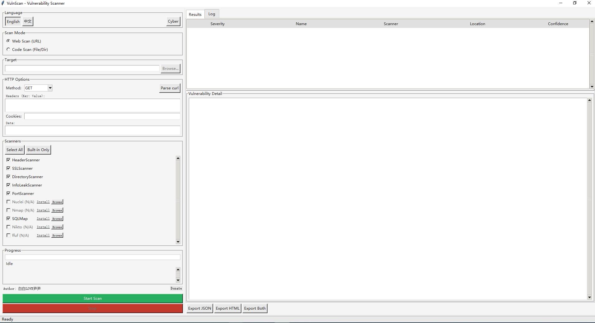
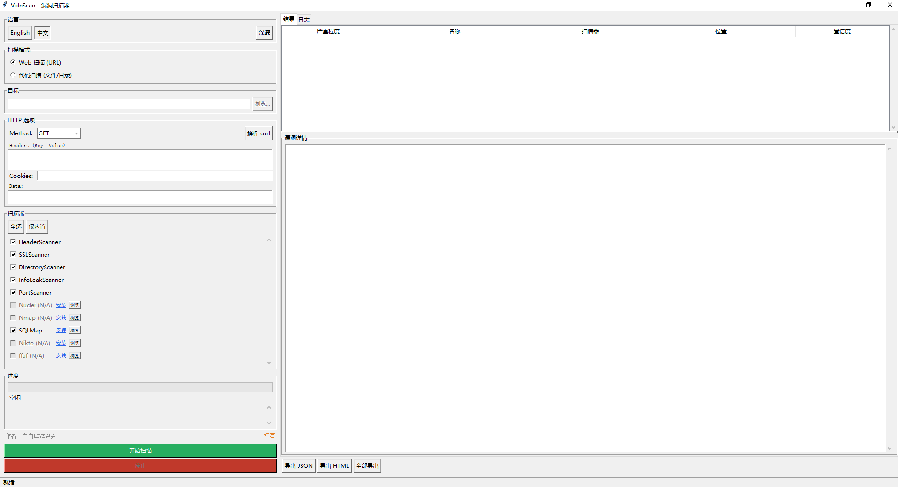

# VulnScan - 漏洞扫描整合工具

<!-- badges -->

> 一款整合型漏洞扫描工具，将 Web DAST、代码 SAST 和 SCA 能力集成于统一界面中。

**[English](README.md)**

## 功能特性

- **7 个内置扫描器** -- 安全头检查（含 CSP 值检查、Cookie 安全属性）、SSL/TLS（证书 + SAN 域名匹配）、敏感路径探测（~130 条）、信息泄露检测（内部 IP/Email 泄露）、端口扫描（61 端口 + Banner）、源码漏洞分析（10 类模式）、依赖 CVE 检查（10 种格式）
- **9 个外部工具集成** -- Nuclei（全模板类型）、Nmap（TCP+UDP 双扫描）、SQLMap（level=5/risk=3 + WAF 绕过）、Nikto（全部 13 类检查）、ffuf（路径×扩展名×递归）、Bandit、Semgrep（4 个规则集）、Trivy（漏洞+密钥+配置错误）、Grype
- **自定义 HTTP 选项** -- 请求头、Cookies、POST 数据、请求方法；支持粘贴浏览器 curl 命令自动填充
- **CLI 和 GUI 双界面** -- 终端命令行或图形窗口，随意选择
- **HTML + JSON 报告生成** -- 丰富的 HTML 报告和机器可读的 JSON 报告
- **漏洞自动去重** -- 多个扫描器发现的相同漏洞自动合并，减少报告噪声
- **调试日志输出** -- `--log-file` 参数将详细扫描日志写入文件，方便排查问题
- **Cyber 深邃/明亮主题** -- GUI 支持Cyber 深邃（GitHub Dark 风格）和明亮主题切换
- **一键安装外部工具** -- GUI 中不可用工具旁显示"安装"和"浏览"按钮；支持 .exe/.py/.pl/.jar/.ps1 脚本；自定义路径保存到 `~/.vulnscan/tool_paths.json`
- **跨平台支持** -- Windows / macOS / Linux
- **中英文双语** -- 自动检测系统语言或手动切换

### 界面截图

| 英文界面 | 中文界面 |
|:-:|:-:|
|  |  |

## 快速开始

```bash
git clone https://github.com/bbyybb/vulnscan.git && cd vulnscan
pip install -r requirements.txt

# 检查扫描器可用状态
python main.py status

# Web 扫描 (DAST)
python main.py web https://example.com

# 代码扫描 (SAST + SCA)
python main.py code ./your-project

# 启动图形界面
python main.py gui
```

## CLI 用法

```
vulnscan [-V | --version] [--lang en|zh] [--log-file PATH] <command> [options]
```

### 子命令

| 命令     | 说明                           |
|----------|-------------------------------|
| `web`    | 执行 Web 漏洞扫描 (DAST)       |
| `code`   | 执行代码漏洞扫描 (SAST/SCA)    |
| `status` | 显示扫描器可用状态              |
| `gui`    | 启动图形界面                    |

### 示例

```bash
# Web 扫描（默认设置：所有可用扫描器，同时生成两种报告）
python main.py web https://example.com

# 指定扫描器进行 Web 扫描
python main.py web https://example.com --scanners HeaderScanner SSLScanner

# 自定义输出目录和报告格式
python main.py web https://example.com -o ./reports --format html

# 自定义并发线程数
python main.py web https://example.com --workers 8

# 使用自定义 HTTP 头和 Cookies 扫描（适用于需要认证的站点）
python main.py web https://example.com -H "Authorization: Bearer token" -H "Content-Type: application/json" --cookie "session=abc123"

# 使用 POST 方法和请求体扫描
python main.py web https://example.com --method POST --data '{"key":"value"}'

# 查看版本
python main.py --version

# 将调试日志写入文件
python main.py --log-file scan.log web https://example.com

# 代码扫描
python main.py code ./your-project

# 指定扫描器进行代码扫描
python main.py code ./your-project --scanners FileAnalyzer DependencyScanner

# 仅生成 JSON 报告
python main.py code ./your-project --format json -o ./reports

# 检查扫描器状态
python main.py status

# 切换语言
python main.py --lang zh status
python main.py --lang en web https://example.com

# 启动图形界面
python main.py gui
```

## 图形界面 (GUI)

启动图形界面：

```bash
python main.py gui
# 或直接运行（无参数默认启动 GUI）
python main.py
```

GUI 提供以下功能：

- 目标 URL/路径输入
- 扫描器选择（可单独开关各扫描器）
- 实时扫描进度显示
- 漏洞结果表格，支持按严重级别筛选
- 一键生成 HTML/JSON 报告
- 扫描器状态概览
- 中英文语言切换

## 内置扫描器

| 扫描器              | 类型  | 目标   | 说明                                     |
|---------------------|-------|--------|------------------------------------------|
| HeaderScanner       | DAST  | URL    | HTTP 安全响应头检查                       |
| SSLScanner          | 基础设施 | URL | SSL/TLS 证书和协议检查                    |
| DirectoryScanner    | DAST  | URL    | 敏感路径和文件暴露检测                     |
| InfoLeakScanner     | DAST  | URL    | 服务器信息泄露检测                         |
| PortScanner         | 基础设施 | URL | TCP 端口扫描，含 Banner 抓取              |
| FileAnalyzer        | SAST  | 文件   | 源代码漏洞模式匹配                         |
| DependencyScanner   | SCA   | 文件   | 依赖组件漏洞检查（通过 OSV API）            |

## 外部工具扫描器

以下扫描器需要单独安装外部工具。

| 扫描器   | 类型  | 目标   | 说明                            | 安装命令                                          |
|----------|-------|--------|---------------------------------|--------------------------------------------------|
| Nuclei   | DAST  | URL    | 基于模板的漏洞扫描器             | `go install github.com/projectdiscovery/nuclei/v3/cmd/nuclei@latest` |
| Nmap     | 基础设施 | URL | 网络端口和服务扫描器             | 从 https://nmap.org/download.html 下载             |
| SQLMap   | DAST  | URL    | SQL 注入检测工具                 | `pip install sqlmap`                              |
| Nikto    | DAST  | URL    | Web 服务器漏洞扫描器             | `sudo apt install nikto` (Linux)、`brew install nikto` (macOS) |
| ffuf     | DAST  | URL    | Web 模糊测试与路径发现           | 从 https://github.com/ffuf/ffuf/releases 下载      |
| Bandit   | SAST  | 文件   | Python 安全代码检查工具          | `pip install bandit`                              |
| Semgrep  | SAST  | 文件   | 多语言静态代码分析               | `pip install semgrep`                             |
| Trivy    | SCA   | 文件   | 文件系统漏洞扫描器               | 从 https://github.com/aquasecurity/trivy/releases 下载 |
| Grype    | SCA   | 文件   | 依赖组件漏洞扫描器               | `brew install grype` (macOS)、从 https://github.com/anchore/grype/releases 下载 |

使用 `python main.py status` 查看哪些外部工具已安装且可用。

## 配置

### 语言设置

VulnScan 支持中文和英文。默认自动检测系统语言，也可手动设置：

- **环境变量**：`VULNSCAN_LANG=zh` 或 `VULNSCAN_LANG=en`
- **CLI 参数**：`python main.py --lang zh` 或 `python main.py --lang en`
- **GUI 界面**：使用界面中的语言切换按钮

优先级：`--lang` 参数 > `VULNSCAN_LANG` 环境变量 > 系统语言自动检测。

## 项目结构

```
vulnscan/
├── .github/
│   ├── ISSUE_TEMPLATE/
│   │   ├── bug_report.md            # Bug 报告模板
│   │   └── feature_request.md       # 功能请求模板
│   ├── workflows/
│   │   ├── build.yml                # 构建与发布工作流
│   │   └── test.yml                 # CI 测试工作流
│   ├── dependabot.yml               # Dependabot 配置
│   └── PULL_REQUEST_TEMPLATE.md     # PR 模板
├── docs/
│   └── screenshots/                 # GUI 界面截图
├── scripts/
│   ├── build.py                     # PyInstaller 构建脚本
│   └── update_hashes.py             # 完整性哈希更新脚本
├── vulnscan/
│   ├── __init__.py                  # 包信息（__version__、__author__）
│   ├── cli.py                       # CLI 界面（argparse + rich）
│   ├── gui.py                       # GUI 界面（tkinter）
│   ├── engine.py                    # 核心扫描引擎（并发执行）
│   ├── models.py                    # 数据模型（ScanResult、Vulnerability 等）
│   ├── registry.py                  # 扫描器注册表与可用性检查
│   ├── report.py                    # 报告生成器（HTML + JSON）
│   ├── utils.py                     # 工具函数
│   ├── i18n.py                      # 国际化框架
│   ├── integrity.py                 # 完整性校验模块
│   ├── locale/
│   │   ├── __init__.py
│   │   └── messages.py              # 中英文消息定义
│   ├── scanners/
│   │   ├── __init__.py
│   │   ├── base.py                  # Scanner / ExternalScanner 基类
│   │   ├── builtin/
│   │   │   ├── __init__.py
│   │   │   ├── header_scanner.py    # HTTP 安全头检查
│   │   │   ├── ssl_scanner.py       # SSL/TLS 检查
│   │   │   ├── directory_scanner.py # 敏感路径检测
│   │   │   ├── info_leak_scanner.py # 信息泄露检测
│   │   │   ├── port_scanner.py      # TCP 端口扫描
│   │   │   ├── file_analyzer.py     # 源代码分析（SAST）
│   │   │   └── dependency_scanner.py# 依赖检查（SCA）
│   │   └── external/
│   │       ├── __init__.py
│   │       ├── nuclei_scanner.py    # Nuclei 集成
│   │       ├── nmap_scanner.py      # Nmap 集成
│   │       ├── sqlmap_scanner.py    # SQLMap 集成
│   │       ├── nikto_scanner.py     # Nikto 集成
│   │       ├── ffuf_scanner.py      # ffuf 集成
│   │       ├── bandit_scanner.py    # Bandit 集成
│   │       ├── semgrep_scanner.py   # Semgrep 集成
│   │       ├── trivy_scanner.py     # Trivy 集成
│   │       └── grype_scanner.py     # Grype 集成
│   ├── assets/                      # 二维码和图标资源
│   └── data/                        # 扫描数据文件（端口、路径、模式）
├── tests/
│   ├── __init__.py
│   ├── conftest.py
│   ├── test_models.py
│   ├── test_utils.py
│   ├── test_scanners.py
│   ├── test_builtin_scanners.py
│   ├── test_external_scanners.py    # 外部扫描器集成测试
│   ├── test_report.py
│   ├── test_engine.py
│   ├── test_cli.py                  # CLI 界面测试
│   ├── test_gui.py                  # GUI 界面测试
│   ├── test_i18n.py                 # 国际化测试
│   ├── test_integrity.py            # 完整性校验测试
│   └── test_integration.py
├── main.py                          # 统一入口（CLI / GUI）
├── pyproject.toml                   # 项目元数据和依赖配置
├── requirements.txt                 # pip 依赖
└── reports/                         # 生成的报告输出目录
```

## 开发

```bash
# 安装依赖
pip install -r requirements.txt

# 安装开发依赖
pip install pytest pytest-cov

# 运行测试
python -m pytest tests/ -v

# 运行测试（含覆盖率报告）
python -m pytest tests/ -v --cov=vulnscan --cov-report=term-missing

# 仅运行单元测试（排除集成测试）
python -m pytest tests/ -v -m "not integration"
```

## 构建可执行文件

参见 [BUILDING.md](BUILDING.md) 了解如何使用 PyInstaller 构建独立可执行文件。

## 作者

**白白LOVE尹尹** ([@bbyybb](https://github.com/bbyybb))

## 打赏支持

如果这个工具对你有帮助，欢迎请作者喝杯咖啡：

| 微信支付 | 支付宝 | Buy Me A Coffee |
|:-:|:-:|:-:|
|  |  |  |

- [](https://buymeacoffee.com/bbyybb)

## 许可证

MIT License - see [LICENSE](LICENSE) for details
